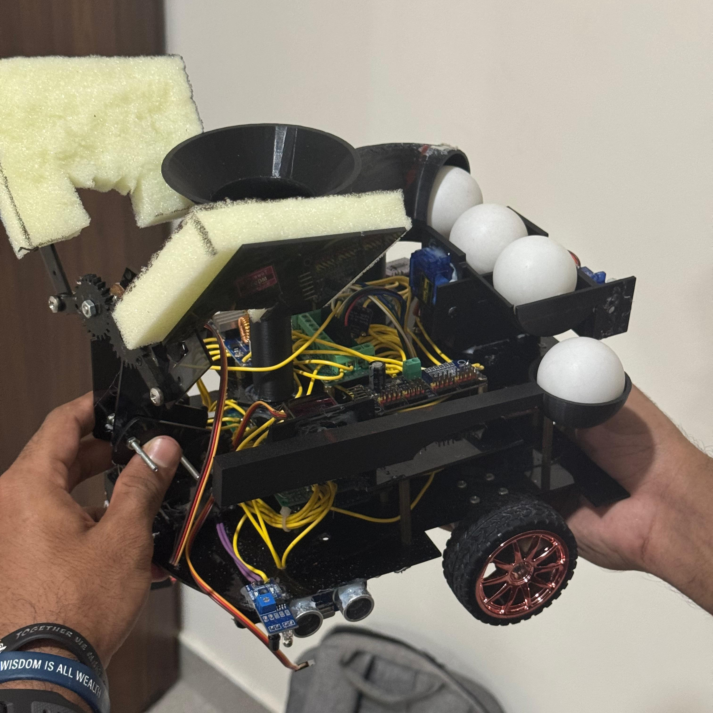
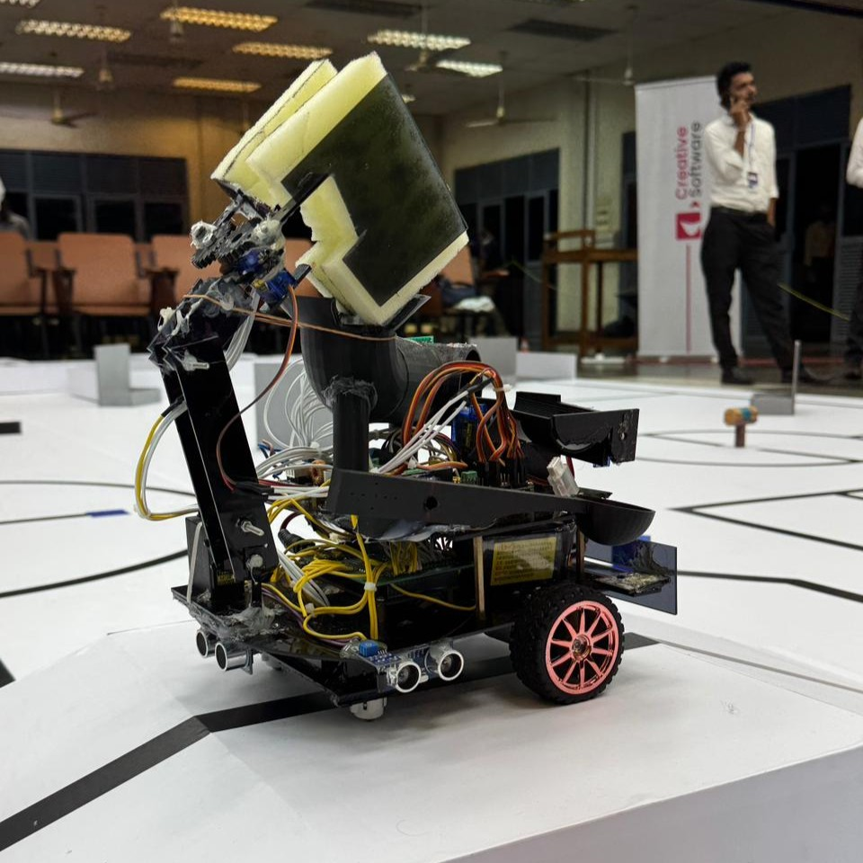

<h1 align="center">Xbotix 2025 Competition Robot</h1>

<p align="center">
  
  
</p>

<p align="center">
  An autonomous robot built for <b>Xbotix 2025</b>, organized by the University of Ruhuna as part of REXTRO, the 25th-anniversary exhibition of the Faculty of Engineering.
</p>

---

## Table of contents

- [About us](#about-us)
- [The competition](#the-competition)
- [Components](#components)
- [Mechanical design](#mechanical-design)
- [Firmware](#firmware)
- [Build and flash](#build-and-flash)
- [Repository structure](#repository-structure)
- [Lessons learned](#lessons-learned)
- [License](#license)

---

## About us

The project began with a team of four:

- Nimith Induwara
- Isiwara Mallawarachchi
- Janiru Dewanmith
- Kavindu Jayalath

A fifth member, **Vinuth Kumarasinghe**, joined later.

This was the first robotics competition any of us had taken part in. As a result, the code still contains many beginner-level flaws, and most of the CAD work was done in Tinkercad, with some parts designed in SolidWorks. We kept everything as it was on competition day so that others can see what a first attempt looks like.

## The competition

**Xbotix 2025** was organized by the **University of Ruhuna** for **REXTRO**.

The competition covered the following challenges:

- Line following
- Wall following
- Object detection
- Object grabbing
- Object throwing
- Colour identification
- Driving across a ramp

Compeition had 20+ pariticipants and We managed to finish in **5th place**

## Components

| Part | Used for |
|---|---|
| Arduino Mega | Main controller |
| JGA25-370 motors with encoders | Drive and position feedback |
| Ultrasonic sensors | Object and wall detection |
| TCRT5000 8-channel IR array | Line following |
| 2 additional IR sensors | Junction / side detection |
| MG90 servo motors | Grabber, feeder and thrower |

The full pin assignment is in [`docs/pinout.md`](docs/pinout.md).

## Mechanical design

The feeder, grabber and thrower were designed mainly in Tinkercad, with some parts in SolidWorks. Model files are in [`hardware/mechanical`](hardware/mechanical).

<p align="center">
  
  
</p>

## Firmware

All code is written for the Arduino IDE.

**Competition sketches** (`firmware/competition/`)

| Sketch | Purpose |
|---|---|
| `final_with_dip` | Final competition code, with the task selected using DIP switches |
| `dotted_line_travelling` | Following a dotted line |
| `maze_solving_rhr` | Maze solving using the right-hand rule |
| `travelling_with_arm` | Junction detection with box grabbing |

**Test sketches** (`firmware/tests/`)

| Sketch | Purpose |
|---|---|
| `arm_grab_testing` | Testing the grabber arm |
| `go_specific_distance` | Driving an exact distance using the encoders |
| `rotate_to_deg` | Turning to an exact angle |
| `wheel_rotate_func` | Testing wheel rotation |
| `tuning_bot` | Tuning PID values and wall following |

## Build and flash

1. Install the [Arduino IDE](https://www.arduino.cc/en/software).
2. Copy the folders inside `firmware/libraries/` into your Arduino `libraries` folder (usually `Documents/Arduino/libraries`).
3. Install the other required libraries listed in [`firmware/libraries/README.md`](firmware/libraries/README.md).
4. Open a sketch from `firmware/competition/` or `firmware/tests/`.
5. Select your board, choose the port and upload.

## Repository structure

```
.
├── docs/                 Pinout and documentation
├── firmware/
│   ├── competition/      Sketches used in the competition
│   ├── tests/            Small sketches for testing each subsystem
│   └── libraries/        Custom and required libraries
├── hardware/
│   └── mechanical/       3D models and design images
└── media/
    └── photos/           Photos of the robot
```

## Lessons learned

- Starting with a first competition taught us how much time goes into testing and tuning, not just writing code.
- This competition became the stepping stone for our team and forged us alot for our future accomplishments in SLRC 2026 (2nd place) and Robofest 2026 (2nd place)
- The code has many beginner-level flaws. Repeated pin definitions and tuning values spread across sketches made changes slow, and a shared configuration file would have helped.
- Most of the CAD was made in Tinkercad and some were made in SOlidWorks. Moving to SolidWorks for all parts would give cleaner, easier-to-edit designs.
- Small test sketches for each subsystem (motors, encoders, arm) saved a lot of time when something stopped working.

## License

Released under the MIT License. See [`LICENSE`](LICENSE) for details.
